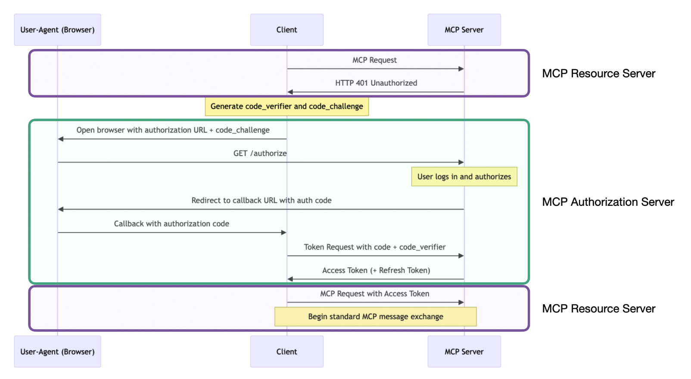

# mcp-workshop

[English](README.md) | 繁體中文 | [簡體中文](README.zh-CN.md)


本工作坊提供使用 [Go 程式語言][2] 構建 MCP（[Model Context Protocol][1]）伺服器及客戶端的完整指南。您將學會如何利用 MCP 來簡化工作流程並提升開發環境。

📖 [簡報：用 Golang 建構 MCP (Model Context Protocol)](https://speakerdeck.com/appleboy/building-mcp-model-context-protocol-with-golang)

## 目錄

- [mcp-workshop](#mcp-workshop)
  - [目錄](#目錄)
  - [課程模組](#課程模組)
    - [模組總覽](#模組總覽)
  - [VS Code MCP 設定](#vs-code-mcp-設定)
    - [結構](#結構)
      - [範例（`.vscode/mcp.json`）](#範例vscodemcpjson)
    - [用法](#用法)
  - [MCP Inspector 工具](#mcp-inspector-工具)
  - [MCP 的 OAuth 協議](#mcp-的-oauth-協議)
  - [MCP 漏洞](#mcp-漏洞)


📖 [簡報：用 Golang 建構 MCP (Model Context Protocol)](https://speakerdeck.com/appleboy/building-mcp-model-context-protocol-with-golang)

## 課程模組

本工作坊由一系列實作模組組成，每個模組展現如何在 Go 中構建 MCP（Model Context Protocol）伺服器及相關基礎架構。

### 模組總覽

- **[01. 基礎 MCP 伺服器](01-basic-mcp/):**
  - 提供支援 stdio 及 HTTP 的極簡 MCP 伺服器實作，採用 Gin。示範伺服器設置、工具註冊、以及日誌與錯誤處理最佳實踐。
  - *重點特色：* stdio/HTTP 雙通道、Gin 整合、可擴充工具註冊
- **[02. 基礎 Token 傳遞](02-basic-token-passthrough/):**
  - 支援 HTTP 與 stdio 的透明認證 token 傳遞，說明 context 注入與帶認證請求的工具開發。
  - *重點特色：* Token 傳遞、context 注入、認證工具範例
- **[03. OAuth MCP 伺服器](03-oauth-mcp/):**
  - 具備 OAuth 2.0 保護的 MCP 伺服器，展示授權、token 與資源 metadata 端點，包含 context token 處理及 API 認證用工具。
  - *重點特色：* OAuth 2.0 流程、受保護端點、context token 傳播、demo 工具
- **[04. 可觀測性](04-observability/):**
  - MCP 伺服器的可觀測性與追蹤，整合 OpenTelemetry 及結構化日誌，包含指標、詳細追蹤與錯誤回報。
  - *重點特色：* 追蹤、結構化日誌、可觀測中介、錯誤報告
- **[05. MCP Proxy](05-mcp-proxy/):**
  - 聚合多個 MCP 伺服器於單一端點的 Proxy 伺服器。支援即時串流、集中設定與安全。
  - *重點特色：* 統一入口、SSE/HTTP 串流、彈性設定、提升安全性

請詳閱每個模組目錄及 `README.md` 以獲得詳細說明與程式範例

## VS Code MCP 設定

`.vscode/mcp.json` 用於配置 VS Code 中 MCP 相關開發，集中登錄伺服器資訊與認證（如 API 金鑰），便於快速切換 MCP 端點及憑證組。

### 結構

- **inputs**: 開啟工作區時提示用戶輸入所需值（如 API 金鑰）。
  - 例如：`perplexity-key` – 以密碼輸入方式安全儲存 Perplexity API Key。
- **servers**: 定義 MCP 伺服器連線資訊，包括協定、端點及可選 header。
  - 例如：
    - `default-stdio-server`: 使用 stdio 與 `mcp-server` 連本地 MCP 伺服器。
    - `default-http-server`: 連遠端 MCP server（HTTP），包含授權 header。
    - `default-oauth-server`、`proxy-server-01`、`proxy-server-02`：其他 HTTP(S) 端點，可自定 header。

#### 範例（`.vscode/mcp.json`）

```json
{
  "inputs": [
    {
      "type": "promptString",
      "id": "perplexity-key",
      "description": "Perplexity API Key",
      "password": true
    }
  ],
  "servers": {
    "default-stdio-server": {
      "type": "stdio",
      "command": "mcp-server",
      "args": ["-t", "stdio"]
    },
    "default-http-server": {
      "type": "http",
      "url": "http://localhost:8080/mcp",
      "headers": {
        "Authorization": "Bearer 1234567890"
      }
    }
    // ... 更多伺服器設定 ...
  }
}
```

### 用法

1. 將 `.vscode/mcp.json` 放於工作目錄或 `.vscode/` 目錄。
2. 依需求於 `inputs` 新增密鑰提示。
3. 設定 `servers`，針對每個服務登錄端點、協定、指令、header 等資訊。
4. 開啟工作區時，VS Code 及支援的 MCP 工具會提示填寫所需資訊並自動採用相關連線。

如需進階自訂，請手動編輯以新增端點或憑證。集中設定可大幅提升管理與開發效率。

[1]: https://modelcontextprotocol.io/introduction
[2]: https://go.dev

## MCP Inspector 工具

[MCP Inspector][01] 是針對 MCP 伺服器測試與除錯的工具，類似 Postman，可用來發送請求並檢視回應，協助開發與問題排查。


[01]: https://github.com/modelcontextprotocol/inspector

## MCP 的 OAuth 協議

下列圖示說明 MCP 內 OAuth 流程與角色之間的溝通順序。



*序列圖詳示每個角色間的互動：*


更多資訊參見：

- [Let's fix OAuth in MCP][3]
- [MCP 授權][4]

[3]: https://aaronparecki.com/2025/04/03/15/oauth-for-model-context-protocol
[4]: https://modelcontextprotocol.io/specification/2025-03-26/basic/authorization

完整 OAuth token 流程詳見 [MCP 規範](https://modelcontextprotocol.io/specification/draft/basic/authorization#authorization-flow-steps)。簡易流程如下：

```mermaid
sequenceDiagram
    participant B as 使用者代理（瀏覽器）
    participant C as 客戶端
    participant M as MCP 伺服器（資源伺服器）
    participant A as 授權伺服器

    C->>M: MCP 請求（無 token）
    M->>C: HTTP 401 Unauthorized + WWW-Authenticate 標頭
    Note over C: 解析 WWW-Authenticate 取得 resource_metadata URL

    C->>M: 請求受保護資源 Metadata
    M->>C: 返回 Metadata

    Note over C: 解析 Metadata 取得授權伺服器\n決定使用哪個 AS

    C->>A: GET /.well-known/oauth-authorization-server
    A->>C: 返回授權伺服器 metadata

    alt 動態客戶端註冊
        C->>A: POST /register
        A->>C: 返回用戶端憑證
    end

    Note over C: 產生 PKCE 參數
    C->>B: 用含 code_challenge 的授權 URL 開啟瀏覽器
    B->>A: 授權請求
    Note over A: 用戶授權
    A->>B: 回調帶回授權碼
    B->>C: 回調返回授權碼
    C->>A: 用 code_verifier 發起 token 請求
    A->>C: 返回 Access token（refresh token）
    C->>M: 附帶 access token 的 MCP 請求
    M-->>C: MCP 回應
    Note over C,M: 取得 token 後，MCP 通信持續進行
```

> **注意：** 遠端 MCP 伺服器目前不支援動態客戶端註冊。

## MCP 漏洞

MCP 常見漏洞如下：


- 指令注入（影響：中等 🟡）
- 工具污染（影響：嚴重 🔴）
- 透過 SSE 開啟連線（影響：中等 🟠）
- 權限提升（影響：嚴重 🔴）
- 永續 context 濫用（影響：低但具風險 🟡）
- 伺服器資料接管/偽造（影響：嚴重 🔴）

更多詳情請參閱 [MCP 漏洞][11]。

[11]: https://www.linkedin.com/posts/eordax_ai-mcp-genai-activity-7333057511651954688-sbNO

## 參考連結

- [An Introduction to MCP and Authorization](https://auth0.com/blog/an-introduction-to-mcp-and-authorization/)
- [Auth0 for MCP Servers](https://auth0.com/ai/docs/mcp/auth-for-mcp)
- [Understanding OAuth2 and implementing identity-aware MCP servers](https://heeki.medium.com/understanding-oauth2-and-implementing-identity-aware-mcp-servers-221a06b1a6cf)
- [Enterprise-Ready MCP](https://aaronparecki.com/2025/05/12/27/enterprise-ready-mcp)
- [[Session] Intro to OAuth for MCP Servers with Aaron Parecki, Okta](https://www.youtube.com/watch?v=mYKMwZcGynw)
